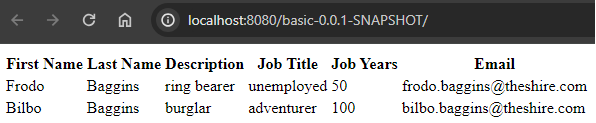
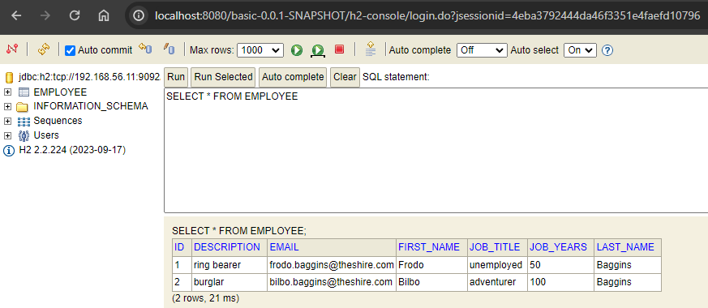

<h1>Class Assignment 3</h1>

---

<h2>Part 2</h2>

For part 2 of the class assignment, I mostly copied the configurations of the ```tut-basic-gradle```
repository, updating the versions of components to suit the needs of the work done in ca1 and ca2-part2
and ensure compatibility amongst modules. Namely, I changed the versions declared in
build.gradle from,

```
plugins {
    id 'org.springframework.boot' version '2.2.5.RELEASE'
    id 'io.spring.dependency-management' version '1.0.9.RELEASE'
    id 'java'
    id 'org.siouan.frontend-jdk11' version '6.0.0'
    id 'war'
}
sourceCompatibility = '1.8'
...
frontend {
    nodeVersion = '12.13.1'
    ...
}
```

to,

```
plugins {
    id 'java'
    id 'org.springframework.boot' version '3.2.4'
    id 'io.spring.dependency-management' version '1.1.4'
    id 'org.siouan.frontend-jdk17' version '8.0.0'
    id 'war'
}
sourceCompatibility = '17'
...
frontend {
    nodeVersion = "16.20.2"
    ...
}
```

updated the version of Gradle in ```gradle\wrapper\gradle-wrapper.properties```,

```
# in tut-basic-gradle
...
distributionUrl=https\://services.gradle.org/distributions/gradle-7.0-bin.zip
...

# in ca2-part2
...
distributionUrl=https\://services.gradle.org/distributions/gradle-8.7-bin.zip
...
```

copied the contents of ```src\main\resources\application.properties``` to ensure the ```web``` VM 
persists data in the ```db``` VM instead of memory,

```
server.servlet.context-path=/basic-0.0.1-SNAPSHOT
spring.data.rest.base-path=/api
#spring.datasource.url=jdbc:h2:mem:jpadb
# In the following settings the h2 file is created in /home/vagrant folder
spring.datasource.url=jdbc:h2:tcp://192.168.56.11:9092/./jpadb;DB_CLOSE_DELAY=-1;DB_CLOSE_ON_EXIT=FALSE
spring.datasource.driverClassName=org.h2.Driver
spring.datasource.username=sa
spring.datasource.password=
spring.jpa.database-platform=org.hibernate.dialect.H2Dialect
# So that spring will no drop de database on every execution.
spring.jpa.hibernate.ddl-auto=update
spring.h2.console.enabled=true
spring.h2.console.path=/h2-console
spring.h2.console.settings.web-allow-others=true
```

and added the ServletInitializer.java class to ```src\main\java\com\greglturnquist\payroll```,

```
package com.greglturnquist.payroll;

import org.springframework.boot.builder.SpringApplicationBuilder;
import org.springframework.boot.web.servlet.support.SpringBootServletInitializer;

public class ServletInitializer extends SpringBootServletInitializer {

  @Override
  protected SpringApplicationBuilder configure(SpringApplicationBuilder application) {
    return application.sources(ReactAndSpringDataRestApplication.class);
  }

}
```

As for the configuration in Vagrantfile, located in the CA3\part2 directory, I changed the version of Java provisioned 
for both VMs from ```openjdk-11-jdk-headless``` to ```openjdk-17-jdk-headless```, and edited the provisions of the
```web``` VM,

```
    web.vm.provision "shell", inline: <<-SHELL, privileged: false
    
      # 1
      sudo apt install zip
      curl -s "https://get.sdkman.io" | bash
      source "$HOME/.sdkman/bin/sdkman-init.sh"
      sdk install gradle 8.7
      
      # 2
      sudo apt-get install git -y
      sudo apt-get install nodejs -y
      sudo apt-get install npm -y
      sudo ln -s /usr/bin/nodejs /usr/bin/node

      # 3
      rm -r devops-23-24-JPE-PSM-1231828
      git clone https://github.com/Filipe-A-Cruz/devops-23-24-JPE-PSM-1231828.git
      cd devops-23-24-JPE-PSM-1231828/CA2/part2
      
      # 4
      rm -r node_modules
      npm install
      gradle clean build
      
      # 5
      java -jar build/libs/basic-0.0.1-SNAPSHOT.war
```

Briefly touching upon various elements of this provision:

1. I opted for the installation of the latest version of Gradle using the community project SDKMAN!. 
Using this over the gradle wrapper is a personal preference with no bearing on the functionality of the project.

2. I'm running the Spring Boot application directly instead of deploying it to Tomcat. 
Spring Boot uses Tomcat by default to deploy apps, so I felt the additional deployment to Tomcat was unnecessary.

3. Here I've added a line to delete the folder containing the clone of my DevOps repository before re-cloning it. 
During this class assignment I found it useful to run ```vagrant reload --provision``` instead of 
destroying and recreating new VMs whenever I wanted to test minor changes to Vagrantfile or the configurations in ca2-part2. 
In retrospective, instead of deleting and re-cloning the repository, I could have just added ```git pull``` to Vagrantfile.

4. I came across an unexpected roadblock with the folder node_modules. When deploying the ```web``` VM, 
I'd receive a "Permission denied" message from Ubuntu relative to this folder, resulting in a failed build. 
After some googling, I learned this issue occurs whenever the node_modules folder was created in a Windows 
environment and then imported into Linux. As a solution, I added ```rm -r node_modules``` to delete the folder 
and ```npm install``` to rebuild it. In retrospective, I should have investigated if this issue could be 
solved using ```chmod```.

5. See point 2.

With these configurations, I then execute ```$ vagrant up``` from within the CA3\part2 directory for the initial 
provisioning, and ```$ vagrant suspend``` or ```$ vagrant resume``` whenever I need to stop and restart the VMs, 
respectively. 

The app works as expected, including the additional features added in the class assignment 1 and ported to ca2-part2. 
Namely, I was able to add a new employee from the Windows cmd line,

```
$ curl -X POST localhost:8080/basic-0.0.1-SNAPSHOT/api/employees -d "{\"firstName\": \"Bilbo\", \"lastName\": \"Baggins\", \"description\": \"burglar\", \"jobTitle\": \"adventurer\", \"jobYears\": \"100\", \"email\": \"bilbo.baggins@theshire.com\"}" -H "Content-Type:application/json"
```

with support for several additional fields added in ca1. Browsing to http://localhost:8080/basic-0.0.1-SNAPSHOT/, the newly 
added employee is displayed by the ```web``` VM,



The borders of the table are not rendered correctly, I'm unsure what's causing the problem, but I felt this was a minor issue. 
Similarly, browsing to http://localhost:8080/basic-0.0.1-SNAPSHOT/h2-console/ and using the connection string
```jdbc:h2:tcp://192.168.56.11:9092/./jpadb``` (user: sa, blank password), the newly added employee has been persisted in 
the ```db``` VM, 



---

<h2>Alternative Solution</h2>

VMware Workstation Pro is the industry standard desktop hypervisor and is officially
supported by HashiCorp, the developer of Vagrant. In general, since VMware is a commercial product,
the level of support and user-friendliness is high. HashiCorp also provides documentation
on how to smoothly replace VirtualBox with VMware, see https://developer.hashicorp.com/vagrant/docs/providers/vmware.
For these reasons, VMware is a drop-in replacement for VirtualBox.

As of May 14<sup>th</sup>, 2024 VMware Workstation Pro is free for personal use.

<h3> 1. VMware Workstation Pro installation</h3>

You can download the installer from https://support.broadcom.com/group/ecx/productdownloads?subfamily=VMware+Workstation+Pro. 
You'll need to create an account. As of May 16<sup>th</sup>, 2024, the recommended version for Windows users is 
WMware Workstation Pro 17.0 for Personal Use (Windows), Release 17.5.2. Once the installation is completed, run VMware for 
the first time. When prompted for a license key, select the option "Use VMware Workstation 17 for Personal Use". 

VMware Workstation Pro automatically configures the NAT and host-only network adapters. You can view the configuration in 
the tab Edit>Virtual Network Editor.

<h3> 2. Vagrant VMware Provider installation</h3>

To use Vagrant boxes with VMware Workstation Pro, you'll first need to install the Vagrant VMware Utility, available for 
download at https://developer.hashicorp.com/vagrant/install/vmware. Once the utility is installed, open a cmd line and 
install the Vagrant VMware provider plugin,

```
$ vagrant plugin install vagrant-vmware-desktop
```

<h3> 3. Vagrantfile and other configurations</h3>

You'll need to provision a Vagrant box compatible with VMware. HashiCorp provides a box with Ubuntu 18.04 
"Bionic Beaver". Copy the Vagrantfile used in ca3-part2 to a new folder, e.g. CA3\Alternative, and edit the 
following lines, 

```
Vagrant.configure("2") do |config|
  config.vm.box = "hashicorp/bionic64"
  # config.vm.box = "ubuntu/bionic64"
...
  config.vm.define "db" do |db|
    db.vm.box = "hashicorp/bionic64"
    # db.vm.box = "ubuntu/bionic64"
...
  config.vm.define "web" do |web|
    web.vm.box = "hashicorp/bionic64"
    # web.vm.box = "ubuntu/bionic64"
...
end
```

Additionally, assuming you haven't destroyed the VMs created in part2, the IPv4 addresses ```192.168.56.xxx``` 
are reserved by VirtualBox. Edit the following lines on Vagrantfile, 

```
...
  config.vm.define "db" do |db|
...
    db.vm.network "private_network", ip: "192.168.64.11"
    # db.vm.network "private_network", ip: "192.168.56.11"
...
  config.vm.define "web" do |web|
...
    web.vm.network "private_network", ip: "192.168.64.10"
    # web.vm.network "private_network", ip: "192.168.56.10"
...
```

Note that, depending on the configuration of your host machine, the address space ```192.168.64.xxx``` 
may be reserved, so you may have to set a different IP for you VMs. Since you've edited the IP of the 
```db``` VM, you'll have to edit ```src\main\resources\application.properties```, so that Spring is aware 
of the address of the ```db``` VM, 

```
spring.datasource.url=jdbc:h2:tcp://192.168.64.11:9092/./jpadb;DB_CLOSE_DELAY=-1;DB_CLOSE_ON_EXIT=FALSE
# spring.datasource.url=jdbc:h2:tcp://192.168.56.11:9092/./jpadb;DB_CLOSE_DELAY=-1;DB_CLOSE_ON_EXIT=FALSE
```

<h3> 4. Running the app</h3>

From the cmd line, move to the directory holding Vagrantfile and run ```$ vagrant up``` with the following provider option, 

```
$ cd C:\temp\devops-23-24-JPE-PSM-1231828\CA3\alternative
$ vagrant up --provider vmware_desktop
```

Once the VMs are provisioned and running, you can use the same URLs as in part2 to view the web page created 
by the ```web``` VM, http://localhost:8080/basic-0.0.1-SNAPSHOT/, and the h2-console of the ```db``` VM,
http://localhost:8080/basic-0.0.1-SNAPSHOT/h2-console/ using the connection string
```jdbc:h2:tcp://192.168.64.11:9092/./jpadb``` (user: sa, blank password).

---