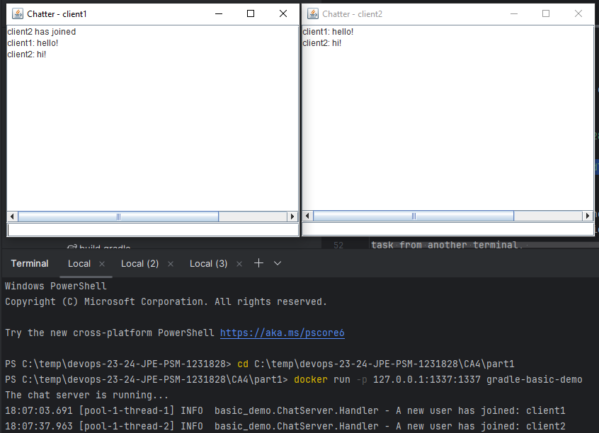

<h1>Class Assignment 4</h1>

---

<h2>Part 1</h2>

In class assignment 4, part 1, I was asked to run the chat server of the gradle-basic-demo 
inside a container, and ensure the chat client running from the host machine is able to 
connect with the server. Furthermore, there should be two versions of the container image: 
v1, where the basic-demo app is built inside the container; and v2, where docker copies a 
pre-built .jar file from the host.

First, in order to ensure the port used in this assignment is not reserved by other 
projects, I made the following changes to ```build.gradle```,

```
...

task runClient(type: JavaExec, dependsOn: classes) {
    ...
    args 'localhost', '1337'
}

task runServer(type: JavaExec, dependsOn: classes) {
    ...
    args '1337'
}

...
```

Then, for version 1 of the assignment, I wrote the following Dockerfile,

```
FROM gradle
WORKDIR /app
COPY . .
CMD gradle runServer
EXPOSE 1337
```

I then built the image and executed the container from the terminal,

```
$ cd C:\temp\devops-23-24-JPE-PSM-1231828\CA4\part1
$ docker build -t gradle-basic-demo .
$ docker run -p 127.0.0.1:1337:1337 gradle-basic-demo
```

I opted not to run the container with the detached option, ```-d```, such that I'm 
informed of when the server initialization is concluded. I then executed the runClient 
task from another terminal, 

```
$ cd C:\temp\devops-23-24-JPE-PSM-1231828\CA4\part1
$ gradle runClient
```

and verified the functionality of the app. The connection of a second client from a third 
terminal also works without issues. I then tagged this container image with v1 and uploaded 
it to Docker Hub,

```
docker tag gradle-basic-demo filipeacruz/gradle-basic-demo:v1
docker push filipeacruz/gradle-basic-demo:v1
```

For v2 of the assignment I replaced the instructions in Dockerfile with the following,

```
FROM gradle
WORKDIR /app
COPY build/libs/part1-0.1.0.jar .
CMD java -cp part1-0.1.0.jar basic_demo.ChatServerApp 1337
EXPOSE 1337
```

The remaining steps are identical, except for the tagging and uploading of the image, 
which was tagged as v2,

```
docker tag gradle-basic-demo filipeacruz/gradle-basic-demo:v2
docker push filipeacruz/gradle-basic-demo:v2
```

<br/>

The image below shows version 2 of the assignment.



---