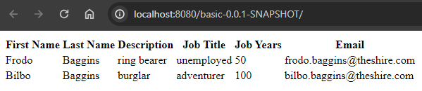

<h1>Class Assignment 4</h1>

---

<h2>Part 2</h2>

For part 2 of this assignment I was asked to containerized my version of the gradle version of the 
spring basic tutorial application. There should be one container for the web app and another for the 
database.

My approach was largely based on the tutorial available at https://bitbucket.org/atb/docker-compose-spring-tut-demo/. 
Inside the folder for CA4\part2 I created the following directory\file structure,

```
CA4/part2/
├─ ca4-part2/
├─ db/
   ├─ Dockerfile
├─ web/
   ├─ Dockerfile
├─ .dockerignore
├─ compose.yaml
```

The ca4-part2 folder will be used to back up the database.

For the database ```Dockerfile```, the configurations are mostly identical to those in the aforementioned 
tutorial, I only changed the installed version of OpenJDK from 8 to 17, although in retrospective 
this may have been unnecessary for the database container,

```
#db Dockerfile

FROM ubuntu

RUN apt-get update -y
RUN apt-get install -y openjdk-17-jdk-headless
RUN apt-get install unzip -y

RUN apt-get install wget -y

RUN mkdir -p /usr/src/app

WORKDIR /usr/src/app/

RUN wget https://repo1.maven.org/maven2/com/h2database/h2/1.4.200/h2-1.4.200.jar

CMD java -cp ./h2-1.4.200.jar org.h2.tools.Server -web -webAllowOthers -tcp -tcpAllowOthers -ifNotExists

EXPOSE 8082
EXPOSE 9092
```

The configuration of the web app ```Dockerfile``` is as follows,

```
#web Dockerfile

FROM ubuntu

RUN apt-get update -y
RUN apt-get install -y openjdk-17-jdk-headless
RUN apt-get install unzip -y

RUN apt-get install git -y
RUN apt-get install nodejs -y
RUN apt-get install npm -y

RUN mkdir -p /tmp/build

WORKDIR /tmp/build/

RUN git clone https://github.com/Filipe-A-Cruz/devops-23-24-JPE-PSM-1231828.git
WORKDIR /tmp/build/devops-23-24-JPE-PSM-1231828/CA2/part2
RUN rm -r node_modules
RUN npm install
RUN chmod u+x gradlew
RUN ./gradlew clean build

CMD java -jar build/libs/basic-0.0.1-SNAPSHOT.war

EXPOSE 8080
```

In this case I've changed the tutorial ```Dockerfile``` significantly, from a Tomcat container to an Ubuntu 
container. I did this because Spring Boot already executes Tomcat to run apps, so I felt that running 
an embedded version of Tomcat from within a containerized version of Tomcat was unnecessary.

For ```.dockerignore``` I searched for a pre-built file that would speed up container builds and 
copy-pasted it without further consideration,

```
#.dockerignore

**/bin
**/obj
**/node_modules
.git
```

Finally, for ```compose.yaml```, the only changes I made were adopting the naming convention currently 
preferred by the developers of Docker (instead of ```docker-compose.yml```), and removing the deprecated
```version: '3'``` configuration at the start of the file. The contents of ```compose.yaml``` are 
otherwise the same as in https://bitbucket.org/atb/docker-compose-spring-tut-demo/,

```
#compose.yaml

services:
  web:
    build: web
    ports:
      - "8080:8080"
    networks:
      default:
        ipv4_address: 192.168.33.10
    depends_on:
      - "db"
  db:
    build: db
    ports:
      - "8082:8082"
      - "9092:9092"
    volumes:
      - ./ca4-part2:/db
    networks:
      default:
        ipv4_address: 192.168.33.11
networks:
  default:
    ipam:
      driver: default
      config:
        - subnet: 192.168.33.0/24
```

Essentially, ```compose.yaml``` sets up the network configuration of the multi-container project. 
I've also changed the name of the folder that will store backups of the database.

From the terminal, I made sure I was in the correct directory and start the containers,

```
$ cd C:\temp\devops-23-24-JPE-PSM-1231828\CA4\part2
$ docker compose up --build
```

The instruction ```docker compose up --build``` builds and executes the application in a single command, 
after the initial build ```docker compose up``` would suffice. The command ```docker-compose up``` is also 
supported. A screenshot of the frontend is shown in the image below, 



As was the case in CA3\part2, the borders of table are correctly rendered, an issue derived from a 
non-critical error in the generation of the folder ```node_modules``` when the command ```$ npm install``` 
is executed inside the container. I wasn't able to fix this yet, but I felt this was a minor issue.

To back up the database while the app is running, I first used the ```docker exec``` command to 
learn the name and path of the database file,

```
$ docker compose exec db bash
$ ls
$ exit
```

and then I used the ```docker cp``` command to back up the database,

```
$ docker compose cp db:/usr/src/app/jpadb.mv.db ca4-part2
```

Finally, after stopping the containers, I tagged and pushed the images to Docker Hub,

```
$ docker compose stop
$ docker tag part2-db filipeacruz/db
$ docker tag part2-web filipeacruz/web
$ docker push filipeacruz/db
$ docker push filipeacruz/web
```

---