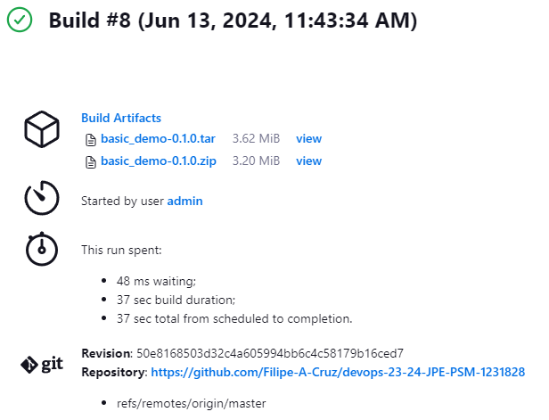
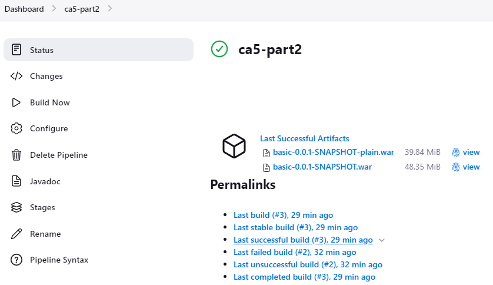

<h1>Class Assignment 5</h1>

---

<h2>Part 1</h2>

For part 1 of ca5, I was asked to implement a simple pipeline of my version of the gradle-basic-demo, 
developed in ca2-part1, using Jenkins. This pipeline should include the following stages: 
1. <strong>Checkout</strong> the code from the repository; 
2. <strong>Assemble</strong> the archive files of the application;
3. <strong>Test</strong> the code base;
4. <strong>Archive</strong> the assembled files in Jenkins.

After following the tutorial provided with the class assignment on how to install Jenkins, 
I first created ```Jenkinsfile``` in the ```CA2/part1``` directory with the following script, 

```
pipeline {
    agent any

    stages {
        stage('Checkout') {
            steps {
                echo 'Checking out...'
                git 'https://github.com/Filipe-A-Cruz/devops-23-24-JPE-PSM-1231828'
            }
        }
        stage('Assemble') {
            steps {
                dir('CA2/part1') {
                   echo 'Assembling...'
                   sh 'chmod u+x gradlew'
                   sh './gradlew clean assemble'
                }
            }
        }
        stage('Test') {
            steps {
                dir('CA2/part1') {
                    echo 'Testing...'
                    sh 'chmod u+x gradlew'
                    sh './gradlew test'
                }
            }
        }
        stage('Archive') {
            steps {
                dir('CA2/part1') {
                    echo 'Archiving...'
                    archiveArtifacts 'build/distributions/*'
                }
            }
        }
    }
}
```

I opted for a declarative pipeline. Since the command ```$ cd``` is not support in Groovy, 
the steps in the stages Assemble, Test and Archive are ran inside a 
```dir('CA2/part1') {...}``` step. As requested, the Assemble stage does not use the
```build``` task.

Next I created a new job in Jenkins, named ca5-part1, with the following configuration, 

```
...
Pipeline
    Definition: Pipeline script from SCM
        SCM: Git
            Repositories:
                Repository URL: https://github.com/Filipe-A-Cruz/devops-23-24-JPE-PSM-1231828
                Credentials: - none -
            Branches to build:
                Branch Specifier (blank for 'any'): */master
            Repository Browser: (Auto)
        Script Path: CA2/part1/Jenkinsfile
        Lightweight checkout enabled.
```

Credentials were not required, the visibility of my repository has been 
set to public since ca3-part2, since the prompt for a password breaks the 
provision script in Vagrantfile.

Below is a screenshot showing the results of the job.



As a side note, the default branch in my DevOps repository was named "main" instead of 
"master", which broke the job regardless of the parameters inserted in the 
```Branch Specifier``` pipeline field. It appears Jenkins assumes the default branch 
is named "master". I changed the default branch name in the repository accordingly.

---

<h2>Part 2</h2>

For part 2 of ca5, I was asked to implement a simple pipeline of my version of the Spring Boot tutorial,
developed in ca2-part2, using Jenkins. This pipeline should include the following stages:
1. <strong>Checkout</strong> the code from the repository;
2. <strong>Assemble</strong> the archive files of the application;
3. <strong>Test</strong> the code base;
4. Publish the <strong>Javadoc</strong> of the application;
5. <strong>Archive</strong> the assembled files in Jenkins;
6. Publish an <strong>Image</strong> of the docker container with Tomcat and the .war file generated in the Assemble stage.

The stages Checkout, Test and Archive are identical to those of part 1. However, for stage Assemble, 
the compilation of the Spring Boot tutorial requires the installation of other packages, such 
as nodejs and npm. To accomplish this I needed root privileges, hence I created a custom 
Jenkins container with the sole purpose of specifying user privileges,

```
FROM jenkins/jenkins:lts-jdk17
USER root

EXPOSE 8080
```

The Assemble stage in the ```CA2/part2/Jenkinsfile``` was scripted as follows, 

```
pipeline {
    agent any
    
    stages {
        ...
        stage('Assemble') {
            steps {
                dir('CA2/part2') {
                   echo 'Assembling...'
                   sh 'apt-get update -y'
                   sh 'apt-get install nodejs -y'
                   sh 'apt-get install npm -y'
                   sh 'rm -r node_modules'
                   sh 'npm install'
                   sh 'chmod u+x gradlew'
                   sh './gradlew clean assemble'
                }
            }
        }
        ...
    }
}
```

As for the Javadoc stage, first I browsed Jenkins to ```Dashboard > Manage Jenkins > Plugins``` and, 
under the available plugins tab, installed the HTML Publisher plugin v1.34. I also modified the ```build.gradle``` 
of CA2/part2 with the following task,

```
task myJavadocs(type: Javadoc) {
    source = sourceSets.main.allJava
    classpath = sourceSets.main.runtimeClasspath
    destinationDir = file("docs")
}
```

As for the stage itself in Jenkinsfile, 

```
pipeline {
agent any

    stages {
        ...
        stage('Javadoc') {
            steps {
                dir('CA2/part2') {
                    echo 'Publishing Javadoc...'
                    sh 'chmod u+x gradlew'
                    sh './gradlew myJavadocs'
                    publishHTML([
                        allowMissing: false,
                        alwaysLinkToLastBuild: false,
                        keepAll: false,
                        reportDir: 'docs',
                        reportFiles: 'index.html',
                        reportName: 'Javadoc',
                        reportTitles: '',
                        useWrapperFileDirectly: true
                        ])
                }
            }
        }
        ...
    }
}
```

Afterwards I built and run the container,

```
$ cd C:\temp\devops-23-24-JPE-PSM-1231828\CA5
$ docker build -t jenkins-with-sudo . 
$ docker run -d -p 127.0.0.1:8080:8080 jenkins-with-sudo
```

and created a pipeline job in Jenkins, named ```ca5-part2``` with the following configurations,

```
...
Pipeline
    Definition: Pipeline script from SCM
        SCM: Git
            Repositories:
                Repository URL: https://github.com/Filipe-A-Cruz/devops-23-24-JPE-PSM-1231828
                Credentials: - none -
            Branches to build:
                Branch Specifier (blank for 'any'): */master
            Repository Browser: (Auto)
        Script Path: CA2/part2/Jenkinsfile
        Lightweight checkout enabled.
```

As a remainder, the visibility of my repository has been set to Public since ca3-part2.

Below is screenshot shot archived artifacts and the newly created Javadoc tab in the sidebar, 



Concerning the Publish Image step, first I created an access token in DockerHub, and in Jenkins, 
under ```Dashboard > Manage Jenkins > Credentials > System > Global credentials (unrestricted)``` 
I created a new set of credentials with the following configurations, 

```
Kind: Username with password
    Scope: Global (Jenkins, nodes, items, all child items, etc)
    Username: filipeacruz
    Password: <DockerHub access token>
    ID: filipeacruz-dockerhub
    Description: filipeacruz-dockerhub
```

I then referenced this credential in ```CA2/part2/Jenkinsfile``` and added the Publish Image stage, 

```
pipeline {
    agent any
    environment {
        DOCKERHUB_CREDENTIALS = credentials('filipeacruz-dockerhub')
    }
    ...
        stage('Publish Image') {
            steps {
                dir('CA2/part2') {
                    echo 'Publishing Docker Image...'
                    sh 'docker build -t filipeacruz/ca5-part2-Filipe-A-Cruz:latest'
                    sh 'echo $DOCKERHUB_CREDENTIALS_PSW | docker login -u $DOCKERHUB_CREDENTIALS_USR --password-stdin'
                    sh 'docker push filipeacruz/ca5-part2-Filipe-A-Cruz:latest'
                    sh 'docker logout'
                }
            }
        }
    }
}
```

I followed the instructions provided at https://www.jenkins.io/doc/book/pipeline/docker/ on how to run a 
docker-inside-a-docker, however I ran into an issue with the aforementioned user privileges which prevented the Assemble 
stage from completing, and consequently the Publish Image stage. I was unable to fix this issue before the deadline.
